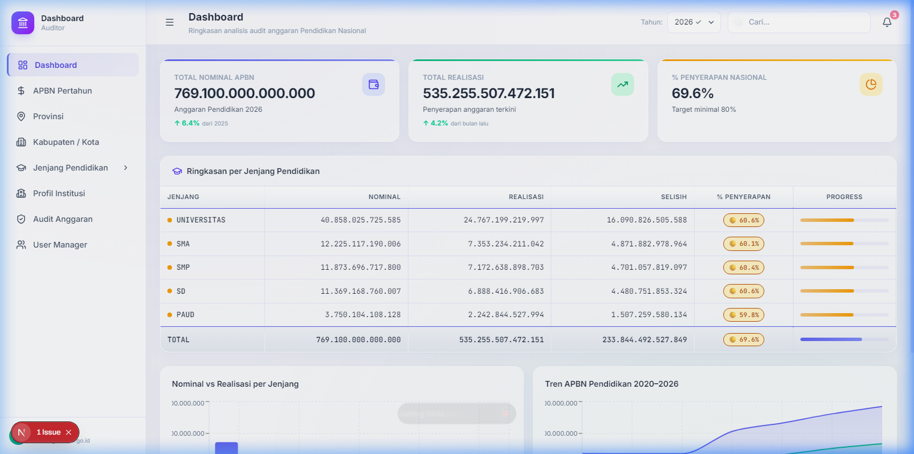
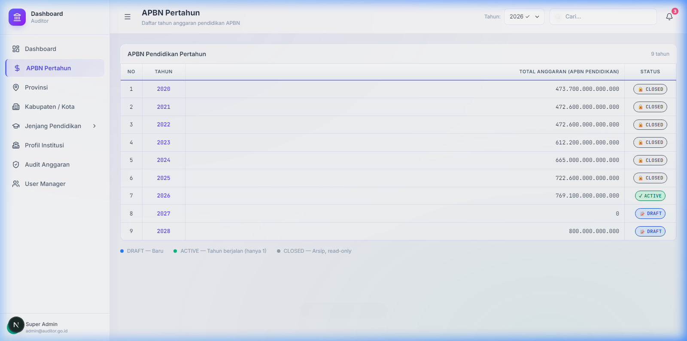
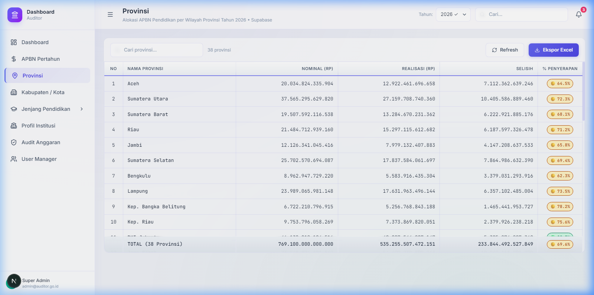
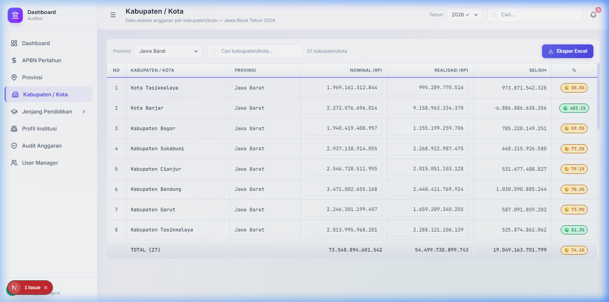
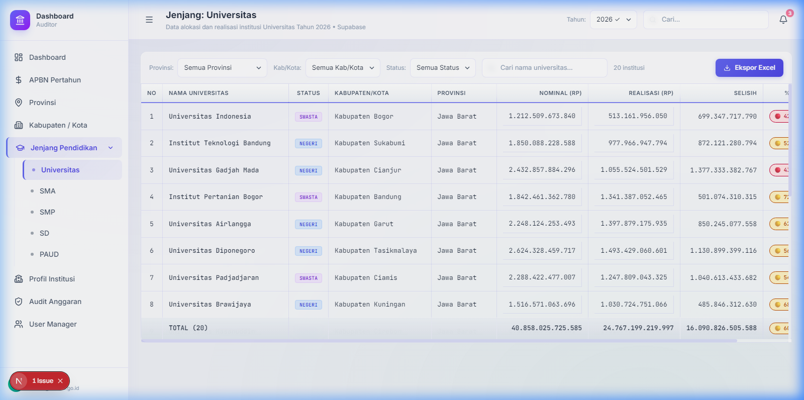
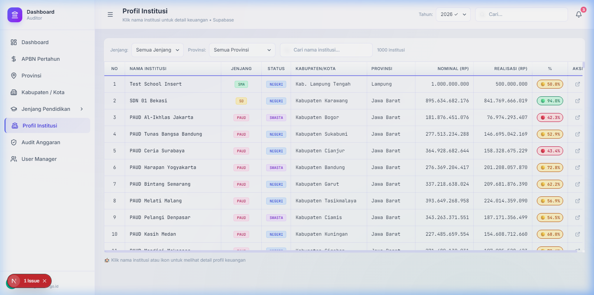
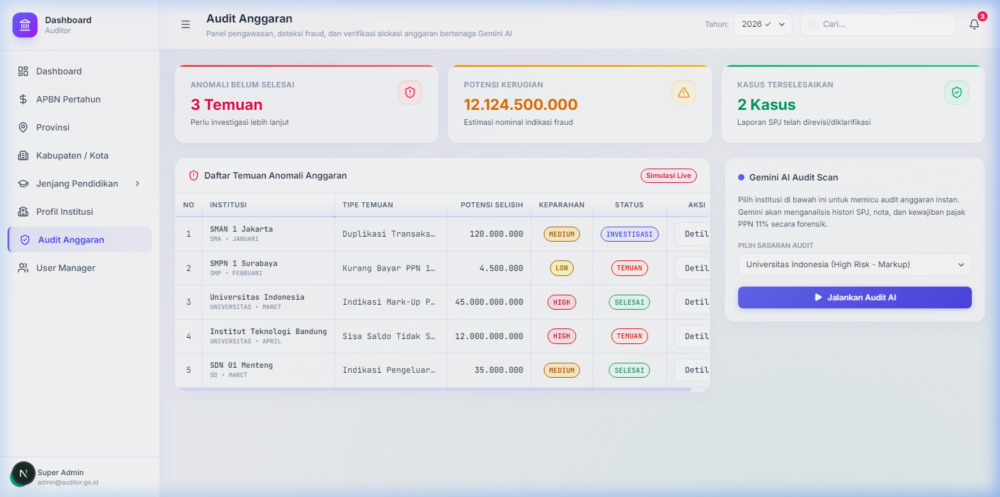
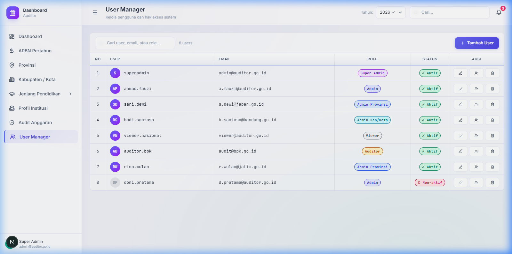
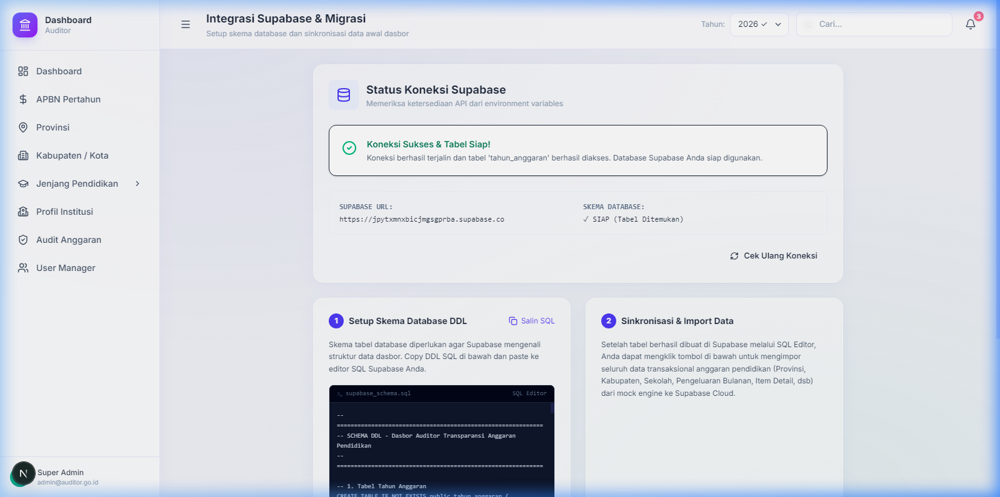

# Dashboard Auditor 🇮🇩

Sistem informasi modern bergaya _spreadsheet_ untuk pemantauan, alokasi, transparansi, dan audit Anggaran Pendapatan dan Belanja Negara (APBN) di sektor Pendidikan Indonesia.

Aplikasi ini menyajikan *dashboard* dengan performa tinggi yang memungkinkan instansi terkait (mulai dari tingkat nasional hingga daerah) memantau alokasi vs realisasi anggaran secara berjenjang dan real-time.



## 📸 Screenshots Menu Aplikasi (Localhost)

Berikut adalah visualisasi antarmuka sistem di lingkungan pengembangan lokal:

### 1. Dashboard Utama
Menampilkan metrik agregat APBN Pendidikan Nasional, bagan Nominal vs Realisasi per Jenjang, serta tren tahunan alokasi anggaran.


---

### 2. APBN Pertahun
Halaman visualisasi data detail alokasi APBN pendidikan per tahun anggaran.


---

### 3. Provinsi
Tabel spreadsheet interaktif tingkat Provinsi untuk melihat alokasi, realisasi, selisih (sisa), serta persentase penyerapan dana daerah.


---

### 4. Kabupaten / Kota
Spreadsheet tingkat Kabupaten / Kota yang merinci alokasi anggaran dan status penyerapan spesifik wilayah.


---

### 5. Jenjang Pendidikan (Universitas)
Halaman per jenjang pendidikan yang melacak alokasi dana institusi secara berjenjang.


---

### 6. Profil Institusi
Detail profil keuangan, sumber dana, pengeluaran bulanan, dan rincian transaksi per institusi pendidikan.


---

### 7. Audit Anggaran
Halaman audit dengan daftar anomali transaksi mencurigakan, dilengkapi status audit (BELUM DIPROSES, INVESTIGASI, SELESAI) yang terintegrasi secara real-time dan ter-sinkronisasi ke Supabase.


---

### 8. User Manager
Panel pengelolaan akun pengguna (Role-Based Access Control) untuk Admin, Auditor, dan Viewer.


---

### 9. Integrasi & Migrasi Supabase
Panel integrasi untuk pengujian koneksi database, inisialisasi tabel skema SQL, dan migrasi/impor data dari mock ke database awan (Supabase).


---

## ✨ Fitur Utama

- **Navigasi Berjenjang (Hierarki)**: Pemantauan dana mulai dari **APBN Nasional -> Provinsi -> Kabupaten/Kota -> Jenjang Pendidikan** (Universitas, SMA, SMP, SD, PAUD).
- **Antarmuka Bergaya Spreadsheet**: 
  - Input data nominal dan realisasi secara langsung *(inline editing)*.
  - Perhitungan **Selisih** dan **Persentase Penyerapan** otomatis (kaskade) dari bawah ke atas.
- **Visualisasi Data**: *Dashboard* analitik dengan metrik utama dan grafik tren tahunan menggunakan *Recharts*.
- **Desain Modern (Glassmorphism)**: UI/UX premium dengan *Light Mode*, efek *frosted glass* (transparan-blur), serta aksen warna yang halus.
- **Manajemen Pengguna (RBAC)**: Role-Based Access Control (Super Admin, Admin Provinsi, Auditor, Viewer, dll.) dengan kontrol status aktif/non-aktif.
- **Sinkronisasi Database**: Terhubung dengan database cloud **Supabase** secara dinamis (fallback otomatis ke simulasi data lokal jika koneksi Supabase terputus).

## 🛠️ Stack Teknologi

Sistem ini dibangun menggunakan ekosistem *web modern* dengan performa tinggi:

- **Framework**: [Next.js 16 (App Router)](https://nextjs.org/) & React 19
- **Bahasa**: TypeScript (Strict Typing)
- **Styling**: [Tailwind CSS v4](https://tailwindcss.com/) dengan arsitektur variabel berbasis `@theme`.
- **State Management**: [Zustand](https://github.com/pmndrs/zustand)
- **Ikon & Grafik**: Lucide React & Recharts
- **Font**: Inter (Google Fonts)

## 📂 Struktur Proyek

```text
dashboard-auditor/
├── app/                  # Next.js App Router (Halaman & Layout)
│   ├── dashboard/        # Halaman utama aplikasi (APBN, Provinsi, Kab/Kota, dll.)
│   ├── globals.css       # Root stylesheet (Tailwind v4 tokens & utility classes)
│   └── layout.tsx        # Root layout (Provider & Font)
├── components/           # Komponen UI Reusable
│   ├── layout/           # Sidebar, Header, Shell
│   └── ui/               # PctBadge, StatusBadge, MetricCard, dll.
├── lib/                  # Utilitas dan Data
│   ├── data/             # Mock data deterministic & generator
│   ├── store/            # Global state (Zustand)
│   └── utils/            # Fungsi format mata uang, persentase, class merger (clsx)
├── PRD/                  # Kumpulan Product Requirements Document (Master)
└── types/                # Definisi tipe data TypeScript (Interface)
```

## 🚀 Memulai Pengembangan (Development)

Pastikan Anda memiliki [Node.js](https://nodejs.org/) (versi 18+ disarankan) terinstal di sistem Anda.

1. **Clone repository ini**
   ```bash
   git clone https://github.com/adimaryanto-stack/Dashboard-Auditor.git
   cd Dashboard-Auditor
   ```

2. **Install dependencies**
   ```bash
   npm install
   ```

3. **Jalankan Development Server**
   ```bash
   npm run dev
   ```

4. **Akses Aplikasi**
   Buka [http://localhost:3002](http://localhost:3002) di browser Anda. Halaman utama adalah rute `/dashboard`.

## 📖 Dokumentasi Lengkap (PRD)

Dokumentasi rancangan produk, arsitektur, dan peta jalan (roadmap) pengembangan telah digabung menjadi satu file untuk memudahkan referensi:
- Cek file **[`PRD/MASTER_PRD.md`](./PRD/MASTER_PRD.md)**

## 🛡️ Lisensi & Kepemilikan

Proyek ini merupakan purwarupa (prototype) untuk inisiatif transparansi anggaran. Dikembangkan untuk keperluan internal instansi terkait.